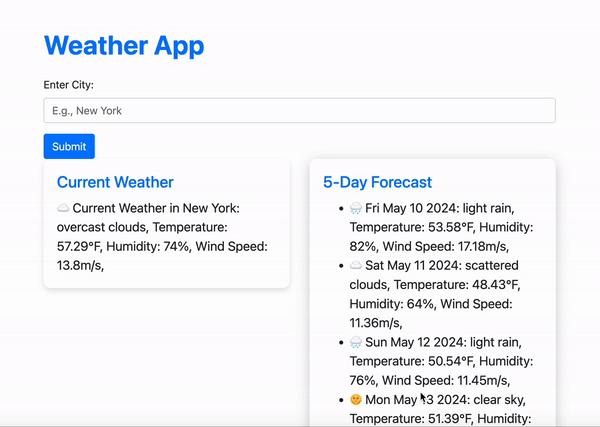

# 06 Server-Side APIs: Weather Dashboard

## Objective

The objective of this project was to create a 5 day and current forecast using the [5 Day Weather Forecast](https://openweathermap.org/forecast5) to retrieve weather data for cities in the US. This app will allow users to search for any specific cities forecast for 5 days and daily. The app incorporates the use of `localStorage` to store any persistent data from the users. 

## User Story

```
AS A traveler
I WANT to see the weather outlook for multiple cities
SO THAT I can plan a trip accordingly
```
## Mock-Up

The following image shows the web application's appearance and functionality:



